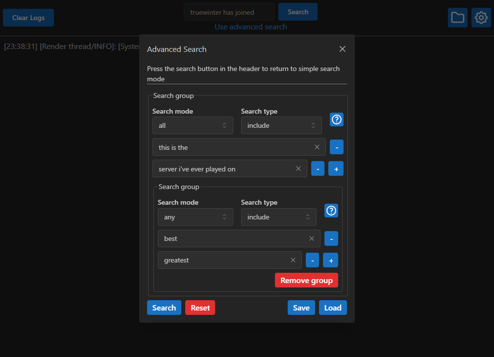

# Birch

Birch is a Minecraft log viewer that allows you to easily search chat logs. It can be used on Windows and Mac.

|  |
|:---:|
| The main Birch window |

## Usage

After installing and opening Birch, it should show the chat from your latest log file. If it can't find the file, your Minecraft installation might not be in the default location. This can be changed from the Birch settings. Note that any changes to the settings require restarting Birch.

### Advanced Search

There may be times when it would be useful to search for multiple things. The advanced search has two modes:
- `all`: a message must contain all of the searched words
- `any`: a message can contain any of the searched words

|  |
|:---:|
| Birch allows you to do complex searches through the Advanced Search popup |

To return to simple search mode, press the search button at the top of the page.

### Old Log Files

You can load old log files from your Minecraft folder, or from anywhere on your computer.

|  |
|:---:|
| Birch allows you to open old log files |

## Disclaimer

Birch is not an official Minecraft product and is not approved by or associated with Mojang or Microsoft.